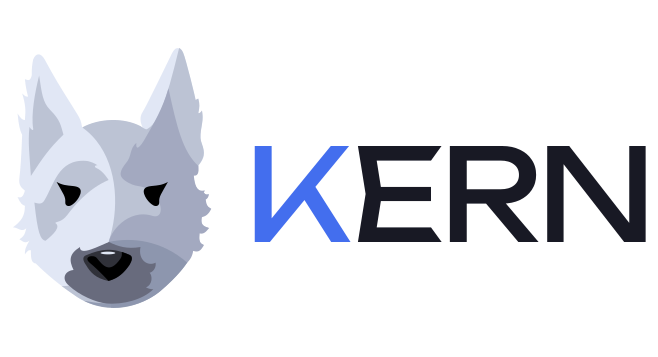

<div style="text-align: center;">
  
</div>

# kern

Инструмент нагрузочного тестирования HTTP-сервисов.

**Kern** — порода терьеров, известная выносливостью и неутомимостью. Именно это и нужно от инструмента нагрузочного тестирования: методично, без устали генерировать запросы и держать нагрузку столько, сколько потребуется.

Аналог [Locust](https://locust.io/) и [k6](https://k6.io/), написанный на Go.

---

## Ключевые возможности

- **Сценарии пользователя** — цепочка шагов: авторизация, извлечение токена, использование в следующих запросах
- **Извлечение переменных** из ответа: `header`, `cookie`, `body` (JSONPath)
- **Генераторы случайных данных**: `{{rnd_uuid}}`, `{{rnd_email}}`, `{{rnd_int(1,100)}}` и другие
- **Stages с `spawn_rate`** — ramp-up / hold / ramp-down, скорость набора VU настраивается как в Locust
- **Prometheus `/metrics`** — метрики в реальном времени: RPS, latency histogram, ошибки, активные VU
- **Отчёт по завершении** — JSON с p50/p90/p95/p99 на каждый шаг + `error_events` с деталями первых ошибок; запись на диск или в S3
- **Протоколы: HTTP/1.1, HTTP/2, HTTP/3** — выбор через `--protocol`; HTTP/1.1 по умолчанию, каждый VU держит собственное соединение
- **TLS fingerprint (uTLS)** — маскировка ClientHello под Chrome/Firefox/iOS, обход WAF и bot-protection
- **Масштабирование в k8s** — флаг `--vus` пропорционально масштабирует план под нужное количество VU на под

---

## Установка

Скачайте готовый бинарь для вашей платформы со [страницы Releases](https://github.com/smogick/kern_public/releases/latest):

| Платформа     | Файл                    |
| ------------- | ----------------------- |
| Linux amd64   | `kern-linux-amd64`      |
| Linux arm64   | `kern-linux-arm64`      |
| macOS amd64   | `kern-darwin-amd64`     |
| macOS arm64   | `kern-darwin-arm64`     |
| Windows amd64 | `kern-windows-amd64.exe`|

```bash
# Linux / macOS
chmod +x kern-linux-amd64
mv kern-linux-amd64 /usr/local/bin/kern
```

Запуск в Docker → [docker.md](docker.md)

---

## Использование

```
kern [flags]

Flags:
  --config        путь к JSON-файлу с тест-планом (обязательный)
  --vus           количество VU для этого экземпляра (0 = брать из плана)
  --protocol      версия HTTP: 1.1 (по умолчанию) | 2 | 3
  --prometheus    включить Prometheus recorder и /metrics (default: true)
  --metrics-addr  адрес /metrics сервера (default: :9090)
  --report        включить итоговый in-memory отчёт (default: true)
  --timeline      добавить в итоговый JSON per-second таймлайн (default: false)
  --timeline-csv  путь для CSV с per-second таймлайном
  --output        куда записать итоговый отчёт:
                    /local/dir          → JSON-файл на диске
                    s3://bucket/prefix/ → JSON в S3
  --shared-transport
                  использовать один общий HTTP transport для всех VU
  --tls-handshake-timeout
                  таймаут TLS-рукопожатия (default: 10s)
  --request-timeout
                  таймаут запроса целиком; 0 = без таймаута (default: 10s)
  --tls-fingerprint
                  fingerprint ClientHello: go|chrome|firefox|ios|randomized
                  (default: go; только с --protocol 1.1)
  --log-vus       логировать изменения числа активных VU (default: false)
  --cpu-monitor   предупреждать при высокой загрузке CPU (Linux, default: false)
  --cpu-threshold порог CPU для --cpu-monitor, % (default: 90)
```

### Примеры

```bash
# Локальный запуск
kern --config plan.json

# С ограничением VU (режим k8s-пода)
kern --config plan.json --vus 25

# С сохранением отчёта
kern --config plan.json --output /tmp/results/
kern --config plan.json --output s3://my-bucket/kern/runs/

# Тест через HTTP/2
kern --config plan.json --protocol 2

# Тест через HTTP/3 (сервер должен поддерживать QUIC)
kern --config plan.json --protocol 3

# TLS fingerprint браузера — обход WAF/bot-protection (только с --protocol 1.1)
kern --config plan.json --tls-fingerprint chrome

# Отключить таймаут запросов (поведение как у Locust по умолчанию)
kern --config plan.json --request-timeout 0

# Логировать рост VU + мониторинг CPU
kern --config plan.json --log-vus --cpu-monitor --cpu-threshold 85

# Сохранить per-second таймлайн в JSON + CSV
kern --config plan.json --timeline --timeline-csv ./results/timeline.csv

# Отключить оверхед метрик и итогового отчёта (чистый генератор нагрузки)
kern --config plan.json --prometheus=false --report=false
```

---

## Формат тест-плана

```json
{
  "stages": [
    { "duration": "30s", "target_vus": 50, "spawn_rate": 10 },
    { "duration": "2m", "target_vus": 50 },
    { "duration": "30s", "target_vus": 0, "spawn_rate": 10 }
  ],
  "steps": [
    {
      "name": "login",
      "request": {
        "method": "POST",
        "url": "https://api.example.com/auth/login",
        "headers": { "Content-Type": "application/json" },
        "body": { "username": "{{rnd_email}}", "password": "secret" }
      },
      "extract": [
        { "var": "token", "from": "header", "key": "Authorization" },
        { "var": "user_id", "from": "body", "path": "$.data.id" }
      ]
    },
    {
      "name": "get_profile",
      "request": {
        "method": "GET",
        "url": "https://api.example.com/users/{{user_id}}",
        "headers": { "Authorization": "Bearer {{token}}" }
      }
    }
  ]
}
```

### Поля стейджа

| Поле         | Тип    | Обязательный | Описание                                                                                  |
| ------------ | ------ | :----------: | ----------------------------------------------------------------------------------------- |
| `duration`   | string |      ✓       | Продолжительность стейджа: `"30s"`, `"2m"`, `"1h30m"`                                    |
| `target_vus` | int    |      ✓       | Целевое количество VU к концу стейджа (0 = остановить)                                    |
| `spawn_rate` | float  |      —       | Скорость набора/сброса VU (VU/с). Если не задан — линейная интерполяция за всю `duration` |

**`spawn_rate` vs без него** при `"duration": "30s", "target_vus": 500`:

|                         | `spawn_rate: 34` | без `spawn_rate`     |
| ----------------------- | ---------------- | -------------------- |
| Когда достигнуто 500 VU | ~14.7 с          | 30 с (в самом конце) |
| Время на полных 500 VU  | ~15.3 с          | 0 с                  |

Для корректного сравнения с Locust задавайте одинаковый `spawn_rate` в обоих инструментах.

### Извлечение переменных (`extract`)

| `from`   | Что извлекает             | Обязательный ключ |
| -------- | ------------------------- | ----------------- |
| `header` | Значение заголовка ответа | `key`             |
| `cookie` | Значение cookie           | `key`             |
| `body`   | Поле JSON (JSONPath)      | `path`            |

### Встроенные генераторы

| Токен                | Результат                      |
| -------------------- | ------------------------------ |
| `{{rnd_int}}`        | Случайное int32                |
| `{{rnd_int(1,100)}}` | int в диапазоне [1, 100)       |
| `{{rnd_int64}}`      | Случайное int64                |
| `{{rnd_float}}`      | Случайное float64              |
| `{{rnd_bool}}`       | `true` или `false`             |
| `{{rnd_uuid}}`       | UUID v4                        |
| `{{rnd_string}}`     | Случайная строка (12 символов) |
| `{{rnd_string(N)}}`  | Случайная строка длиной N      |
| `{{rnd_email}}`      | Случайный email                |
| `{{rnd_name}}`       | Случайное имя (`"John Doe"`)   |
| `{{rnd_phone}}`      | Случайный телефон (`+7...`)    |
| `{{rnd_timestamp}}`  | Unix timestamp (текущее время) |

---

## TLS fingerprint

По умолчанию kern использует стандартный TLS ClientHello Go (`--tls-fingerprint go`).
Некоторые WAF и bot-protection системы блокируют соединения с характерным Go-fingerprint, особенно при запуске с datacenter IP.

Флаг `--tls-fingerprint` включает [uTLS](https://github.com/refraction-networking/utls) и эмулирует ClientHello выбранного браузера:

| Значение     | Fingerprint                       |
| ------------ | --------------------------------- |
| `go`         | Стандартный Go (по умолчанию)     |
| `chrome`     | Google Chrome (актуальная версия) |
| `firefox`    | Mozilla Firefox                   |
| `ios`        | Safari на iOS                     |
| `randomized` | Случайный ALPN                    |

> **Ограничение:** `--tls-fingerprint` совместим только с `--protocol 1.1`.
> При `--protocol 2` kern завершится с ошибкой — Go's HTTP/2 upgrade несовместим с uTLS (`*utls.UConn` ≠ `*tls.Conn`).

---

## Мониторинг во время теста

### Логирование VU (`--log-vus`)

```
level=INFO msg=vus active=17  delta=17
level=INFO msg=vus active=34  delta=17
...
level=INFO msg=vus active=500 delta=17
```

### Мониторинг CPU (`--cpu-monitor`)

Читает `/proc/stat` каждые 5 секунд (только Linux). Если загрузка превышает `--cpu-threshold` (default 90%):

```
level=WARN msg="high cpu usage — load generator may be the bottleneck" cpu_pct=94.3 threshold_pct=90
```

### Prometheus `/metrics`

```
kern_http_requests_total{step, status}    — счётчик запросов
kern_http_request_duration_seconds{step}  — гистограмма задержек
kern_http_errors_total{step}              — счётчик ошибок (5xx + сетевые)
kern_vus_active                           — текущее количество VU
```

---

## Формат итогового отчёта

```json
{
  "version": "0.4.0",
  "started_at": "2026-03-10T14:00:00Z",
  "finished_at": "2026-03-10T14:02:00Z",
  "duration_seconds": 120,
  "total_requests": 180000,
  "total_errors": 0,
  "steps": {
    "get_profile": {
      "requests": 180000,
      "errors": 0,
      "rps": 1500.0,
      "latency": {
        "min_ms": 12.1,
        "avg_ms": 288.4,
        "p50_ms": 271.0,
        "p90_ms": 430.5,
        "p95_ms": 512.3,
        "p99_ms": 890.1,
        "max_ms": 1240.0
      }
    }
  }
}
```

`error_events` — первые 200 ошибок по каждому шагу (5xx и сетевые). Поле отсутствует, если ошибок не было.

При `--timeline=true` в отчёт добавляется поле `timeline_1s` с агрегатами за каждую секунду:
`active_vus`, `requests_interval`, `errors_interval`, `rps`, `error_rps`.

---

→ [Первый запуск: примеры с реальным сервисом](firstrun.md)
